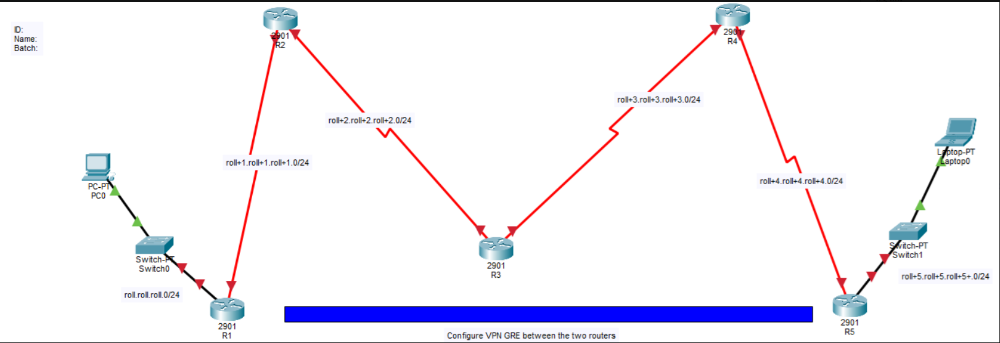

# Project 03 - GRE VPN Configuration

## Overview

This project demonstrates the configuration of a GRE (Generic Routing Encapsulation) VPN tunnel between two remote routers using Cisco Packet Tracer.

## Objectives

- Configure GRE Tunnel
- Configure Static Routing
- Connect Two Remote LANs
- Verify End-to-End Connectivity

## Network Topology

## Technologies Used

- Cisco Packet Tracer
- Cisco IOS
- GRE Tunnel
- Static Routing
- IPv4

## Result

The GRE tunnel was successfully established, allowing communication between two remote LANs.

## Author

Sarfin Uddin Bhuiyan Anik
